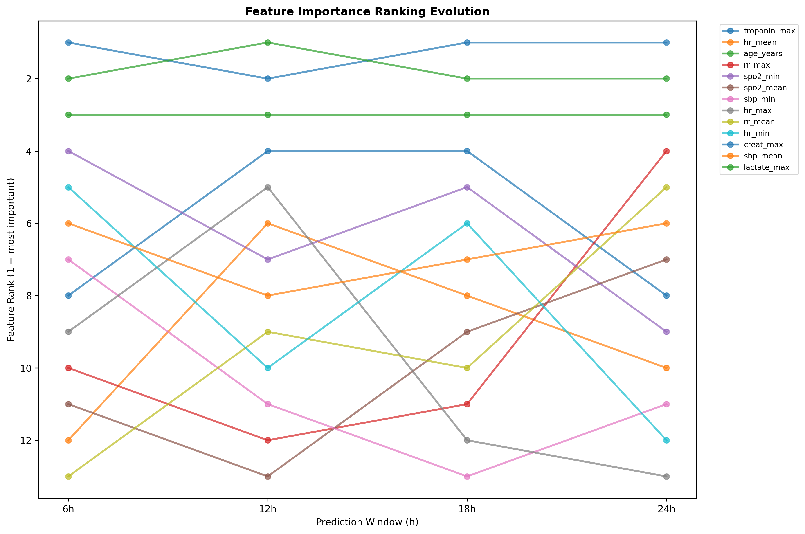
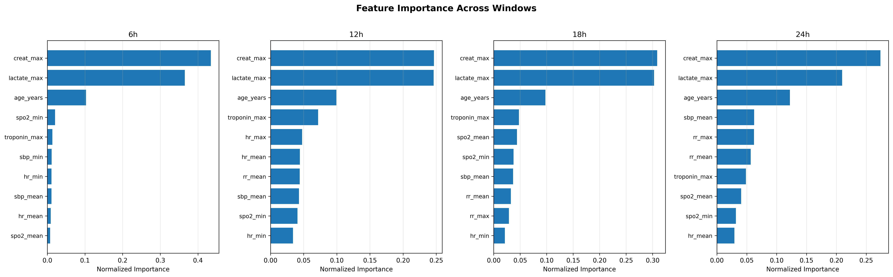
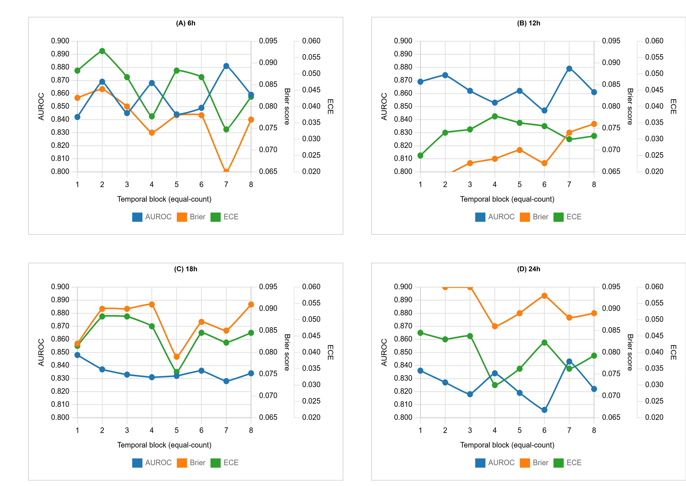
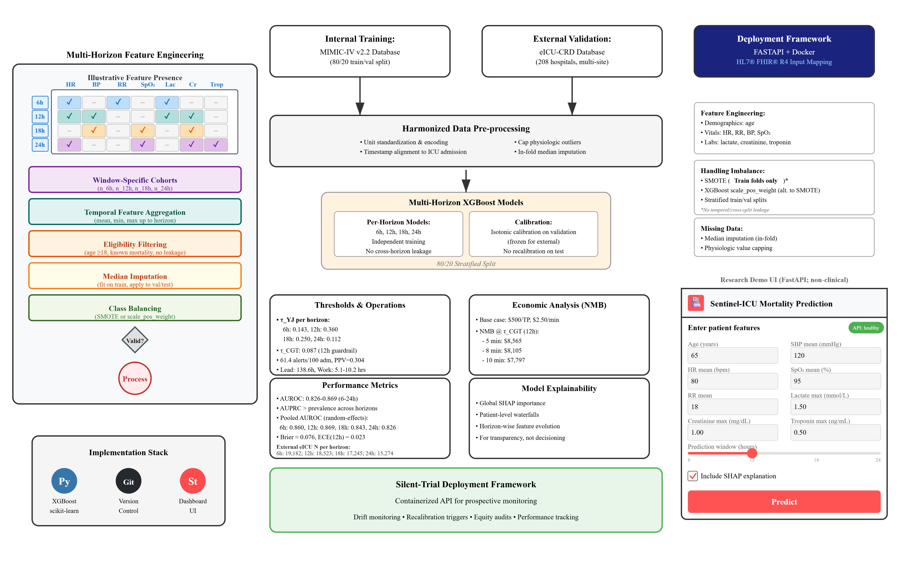
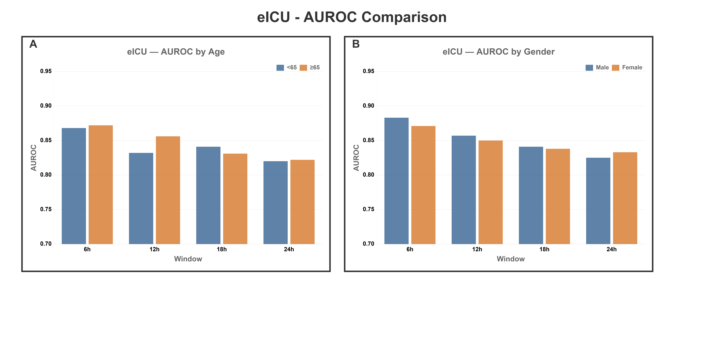
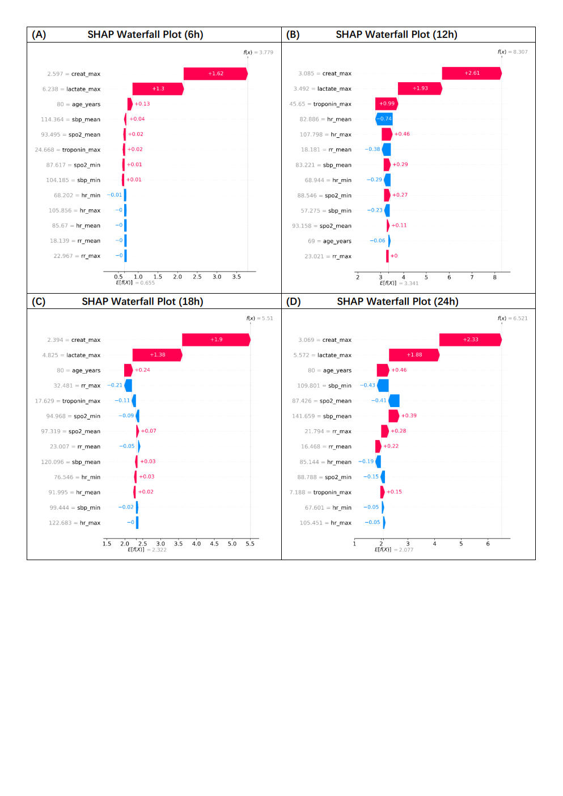
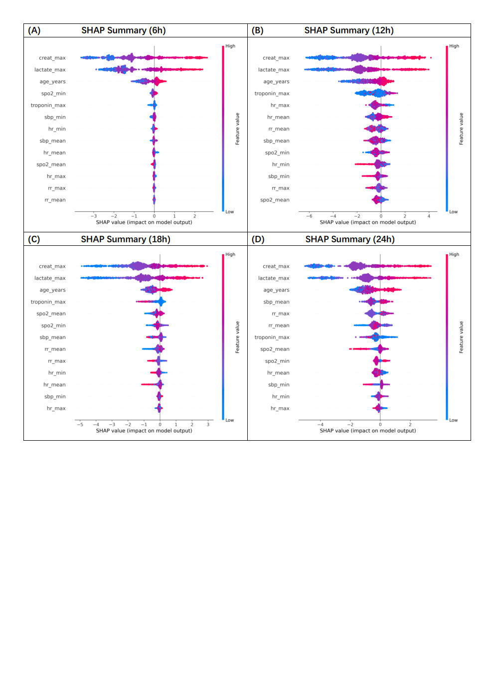
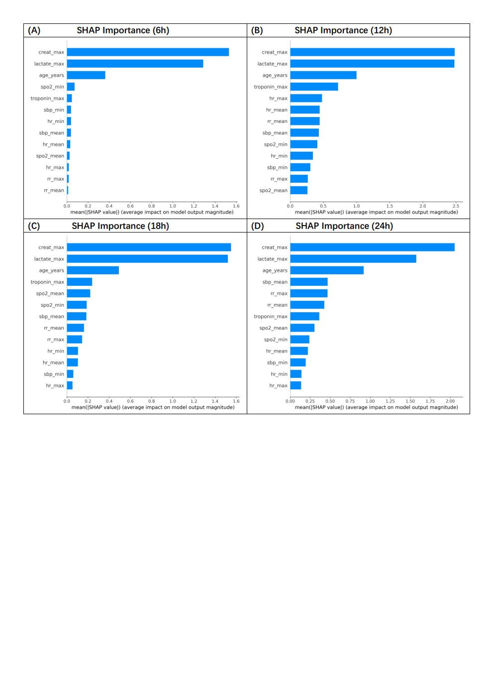

# Sentinel-API

<!-- badges: start -->
[](https://ghcr.io/sjtu-fuxilab/sentinel-api)


[](LICENSE)
<!-- badges: end -->


🏥 Machine Learning API for ICU Mortality Prediction

[](https://www.python.org/downloads/)
[](https://fastapi.tiangolo.com/)
[](https://opensource.org/licenses/MIT)

## 🎯 Overview
Sentinel-API is a REST API for predicting in-hospital mortality among ICU patients (e.g., MI). Models target MIMIC-IV / eICU.

## ✨ Features
- Real-time risk prediction
- 6h/12h/24h/48h windows
- XGBoost + Optuna
- SHAP interpretability
- FastAPI with validation & docs

## 🚀 Quick Start

```bash
git clone https://github.com/Sjtu-Fuxilab/Sentinel-API.git
cd Sentinel-API
pip install -r requirements.txt
```

```bash
python api/main.py
# or:
uvicorn api.main:app --reload --host 0.0.0.0 --port 8000
```

Docs: `http://localhost:8000/docs`

## 📁 Structure
```
Sentinel-API/
├── api/
│   ├── main.py
│   ├── models/
│   ├── data/
│   └── utils/
├── notebooks/
├── requirements.txt
└── README.md
```

## 👥 Authors
Sanwal Ahmad Zafar, Assoc. Prof. Wei Qin · · Fuxilab, Shanghai Jiao Tong University, China. 
## 🐳 Container (GHCR)

```bash
docker pull ghcr.io/sjtu-fuxilab/sentinel-api:latest
docker run --rm -p 8000:8000 ghcr.io/sjtu-fuxilab/sentinel-api:latest
```


## Figures & Demo



















[▶ demo-icu-20250901.mp4](https://github.com/Sjtu-Fuxilab/Sentinel-API/releases/download/v0.1.2/demo-icu-20250901.mp4)  


